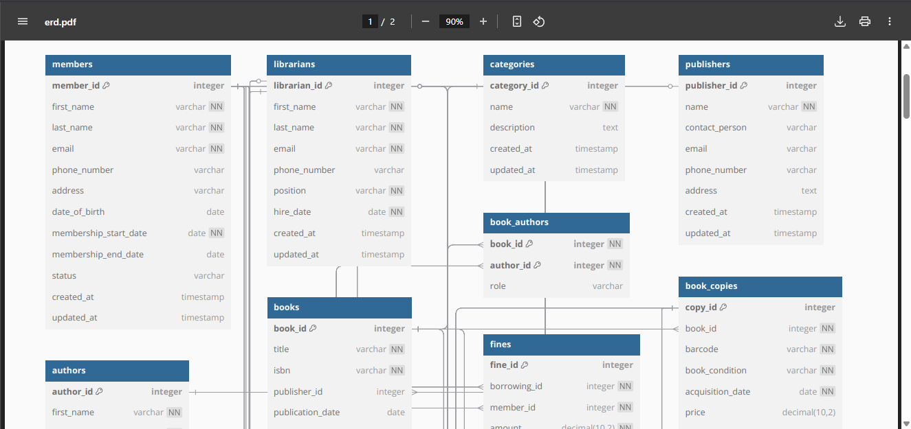
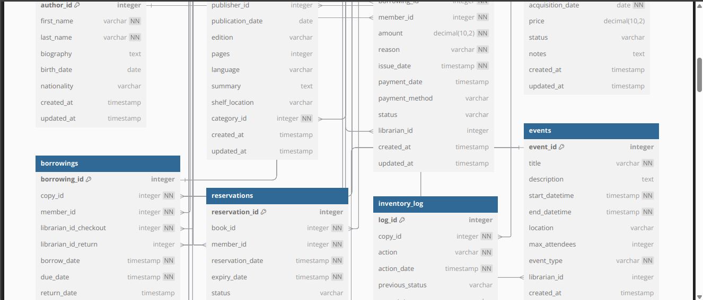
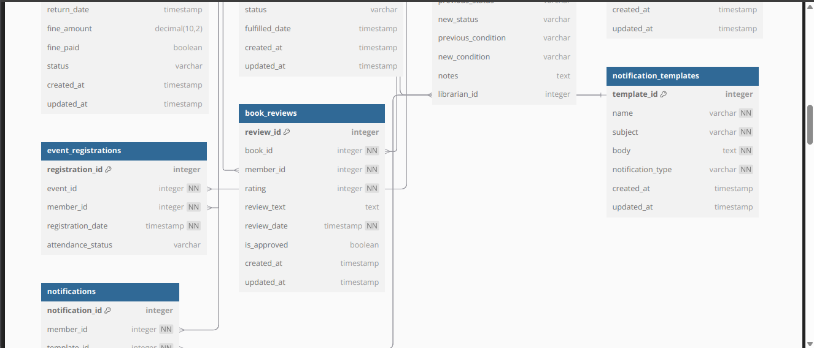
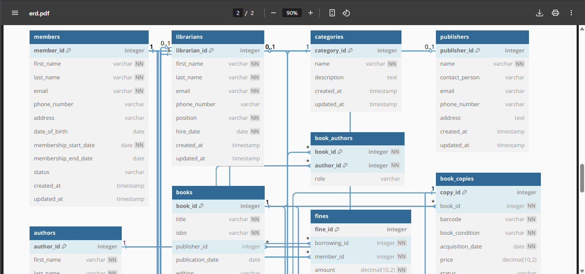
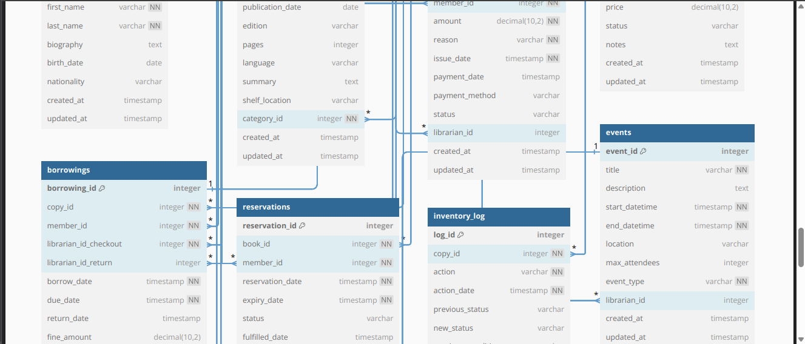
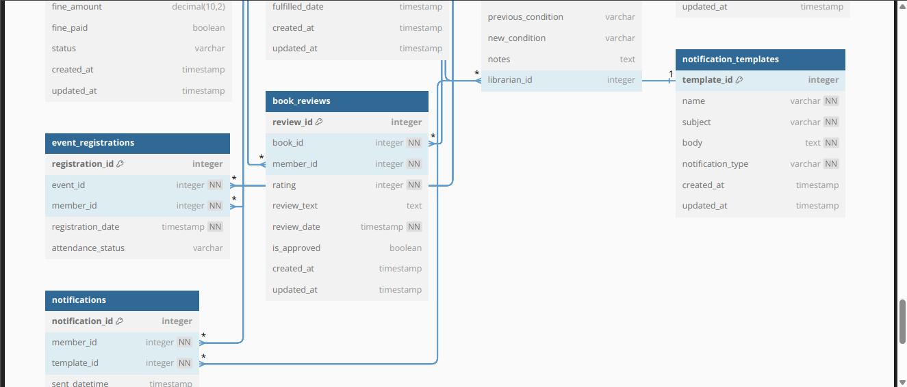

# Library Management System - MySQL Edition

This project implements a comprehensive relational database for a modern library using MySQL.
It manages:
- Books, authors, publishers, categories
- Members and librarians
- Borrowings, reservations, inventory
- Events, book reviews, fines, and notifications

## How to Run/Setup the Project

### Prerequisites
- MySQL Server (e.g., MySQL Workbench, XAMPP, or the `mysql` CLI)
- The provided `.sql` schema and data files

### Steps

1. Clone or Download the Repository
   ```bash
   git clone https://github.com/Kaballah/Library-Database-Management-System.git
   cd Library-Database-Management-System

2. Open MySQL Workbench

4. Import the Schema

5. In MySQL Workbench, go to File > Open SQL Script and select library_management.sql

6. Click the lightning bolt (Run) to execute


**Or in CLI:**

2. Run the bash command
   ```bash
   mysql -u yourusername -p < library_management.sql

3. Login and Explore the Database

   ```sql
   USE library_management;
   SHOW TABLES;
   SELECT * FROM members;

## Entity-Relationship Diagram (ERD)
### **ERD Screenshot:**







Or view the ERD on dbdiagram.io: [ER Diagram](https://dbdiagram.io/d/LMS-681d08025b2fc4582fd0e82c)

Author
Developed by Kabala Ronnie
